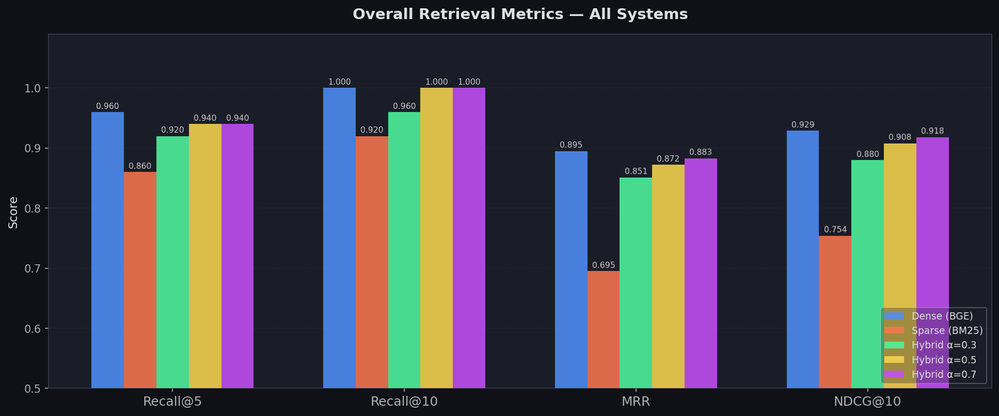
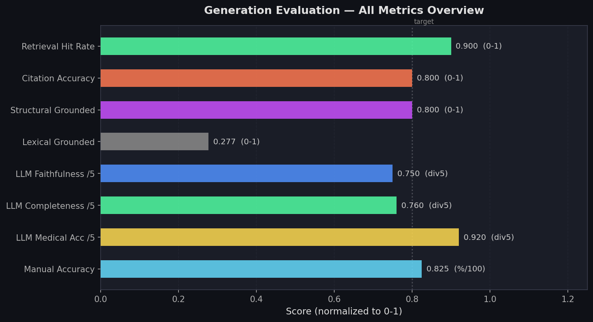

# MediRAG 🏥
### Medical Retrieval-Augmented Generation System

MediRAG is a full-stack **Hybrid RAG pipeline** built on the Merck Manual medical corpus. It combines dense semantic retrieval, sparse lexical retrieval, hybrid fusion, LLM-based grounded generation, and a multi-layer evaluation framework — from raw text to an interactive medical QA interface.

---

## System Overview

```
Merck Manual (raw HTML/text)
         │
         ▼
  Text Cleaning & Section Parsing
         │
         ▼
  Token-Aware Chunking
  800 tokens · 150-token overlap · 4,239 chunks
         │
         ▼
  BGE-large Embeddings (1024-dim, L2-normalized)
         │
         ▼
  FAISS Index (IndexFlatIP · cosine similarity)
         │
    ┌────┴────┐
    ▼         ▼
  Dense     Sparse
  (FAISS)   (BM25)
    └────┬────┘
         │  Weighted RRF Fusion
         ▼
  Top-k Context Selection
         │
         ▼
  LLM Generation (Qwen3-32B · Groq API)
  via Structured prompt 
         │
         ▼
  Evaluation
  Retrieval Metrics · LLM-as-Judge · Manual Grading
         │
         ▼
  Streamlit Demo App
```

## Stack

| Layer | Detail |
|-------|--------|
| Corpus | Merck Manual — 4,239 chunks |
| Embeddings | `BAAI/bge-large-en-v1.5` · 1024-dim · L2-normalized |
| Dense Index | FAISS `IndexFlatIP` |
| Sparse | BM25 |
| Fusion | Weighted RRF |
| Generator | Qwen3-32B via Groq API |
| Demo | Streamlit |

---
## Retrieval Evaluation
**50 curated queries · 3 tiers** (17 Direct · 18 Indirect · 15 Hard)

| System | Recall@5 | Recall@10 | MRR | NDCG@10 | P@5 |
|--------|----------|-----------|-----|---------|-----|
| Dense (BGE) | 0.960 | 1.000 | 0.895 | 0.929 | 0.192 |
| Sparse (BM25) | 0.860 | 0.920 | 0.695 | 0.754 | 0.172 |
| Hybrid α=0.3 | 0.920 | 0.960 | 0.851 | 0.880 | 0.184 |
| Hybrid α=0.5 | 0.940 | 1.000 | 0.872 | 0.908 | 0.188 |
| **Hybrid α=0.7** | **0.940** | **1.000** | **0.883** | **0.918** | **0.188** |

**Tier-wise Performance (Recall@5)**
| System | Direct | Indirect | Hard |
|--------|--------|----------|------|
| Dense (BGE) | 1.000 | 0.887 | 0.787 |
| Sparse (BM25) | 0.698 | 0.800 | 0.567 |
| Hybrid α=0.7 | **0.971** | **0.894** | **0.769** |



---

## Generation Evaluation
**20 queries · 3 tiers** (7 Direct · 7 Indirect · 6 Hard)

### Automated Structural Metrics
| Metric | Score |
|--------|-------|
| Structural Grounded Rate | 80.0% |
| Citation Accuracy | 80.0% |
| Hallucination Rate | 20.0% |
| Lexical Grounded | 27.7% |

### LLM-as-Judge (LLaMA 3.3 70B)
| Metric | Score |
|--------|-------|
| Faithfulness | 3.75 / 5 |
| Completeness | 3.80 / 5 |
| Medical Accuracy | **4.60 / 5** |
| Hallucination Flags | 3 / 20 |

### Manual Grading (0–2 scale)
| Metric | Score |
|--------|-------|
| Answer Accuracy | 82.5% |
| Fully Correct | 70.0% |



---